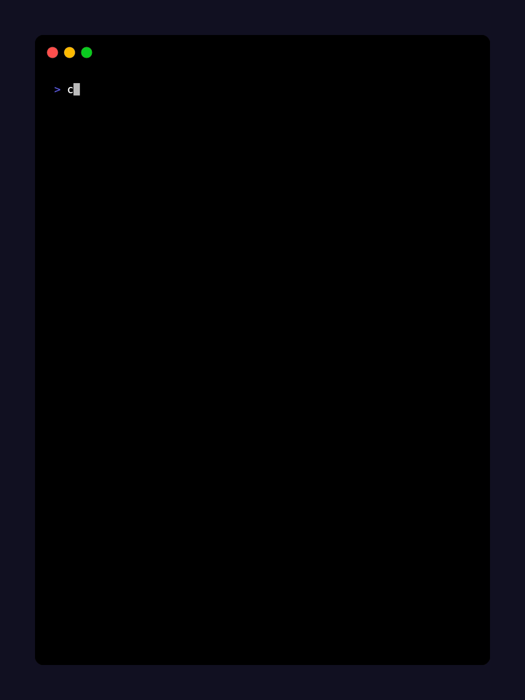
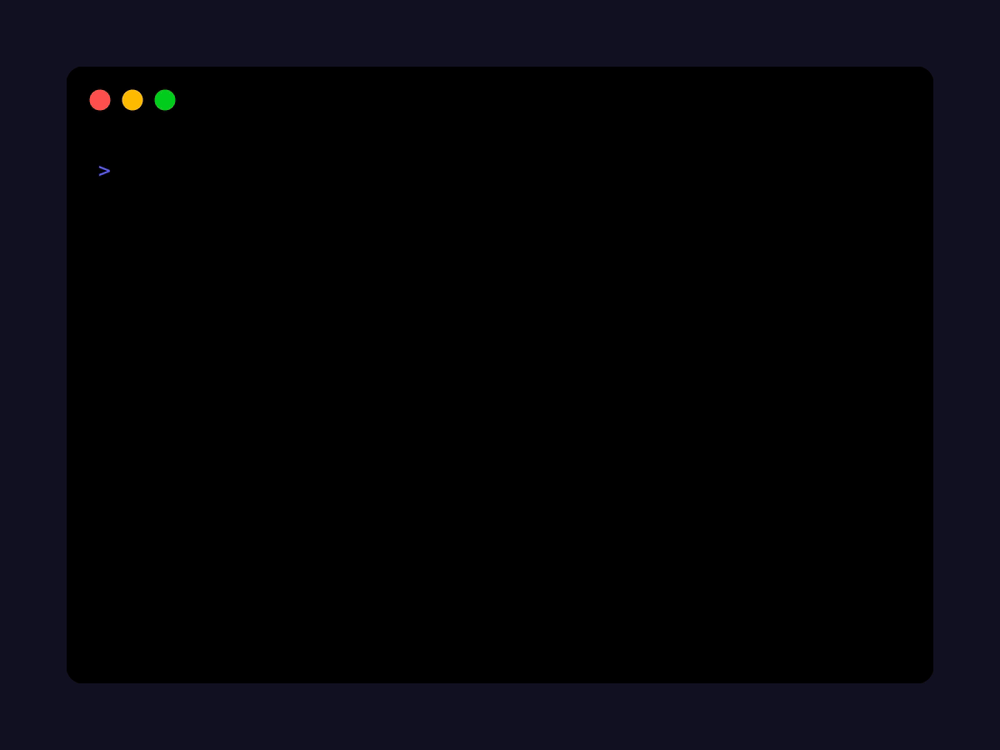
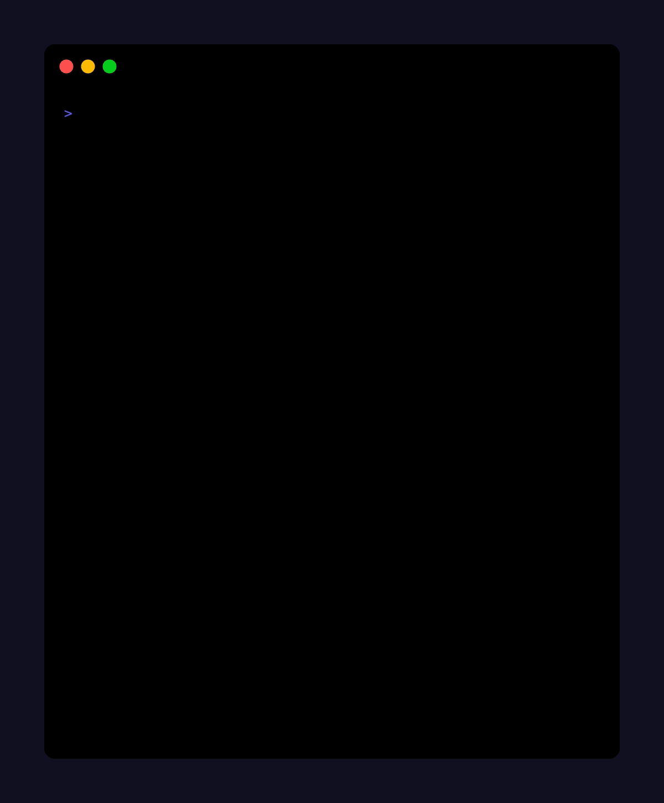
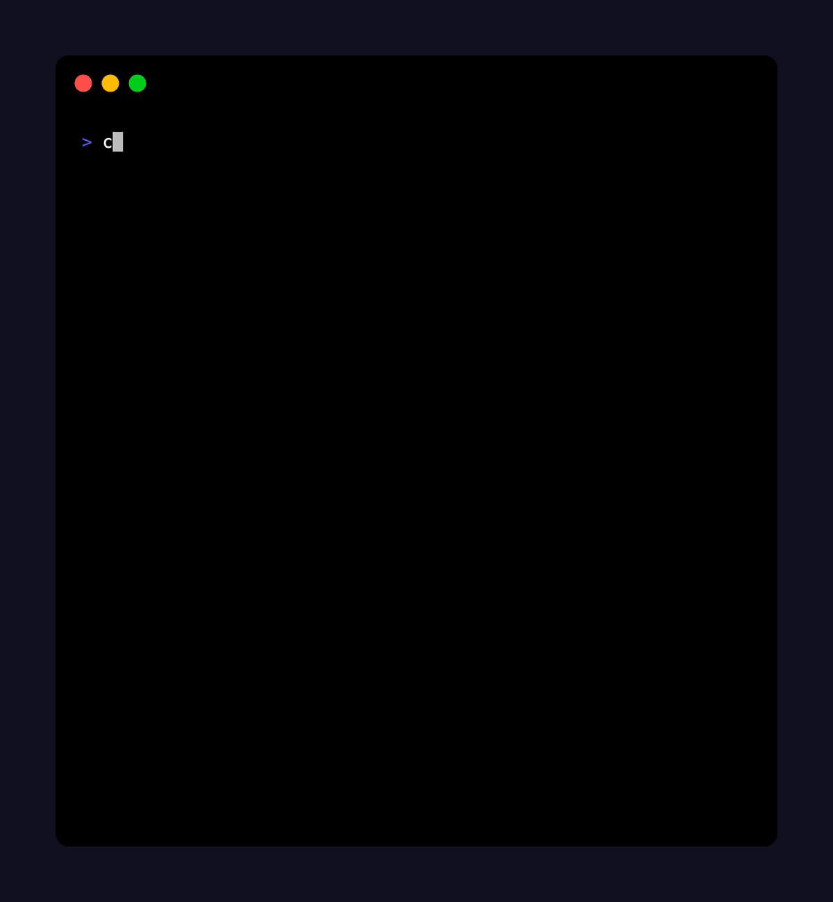
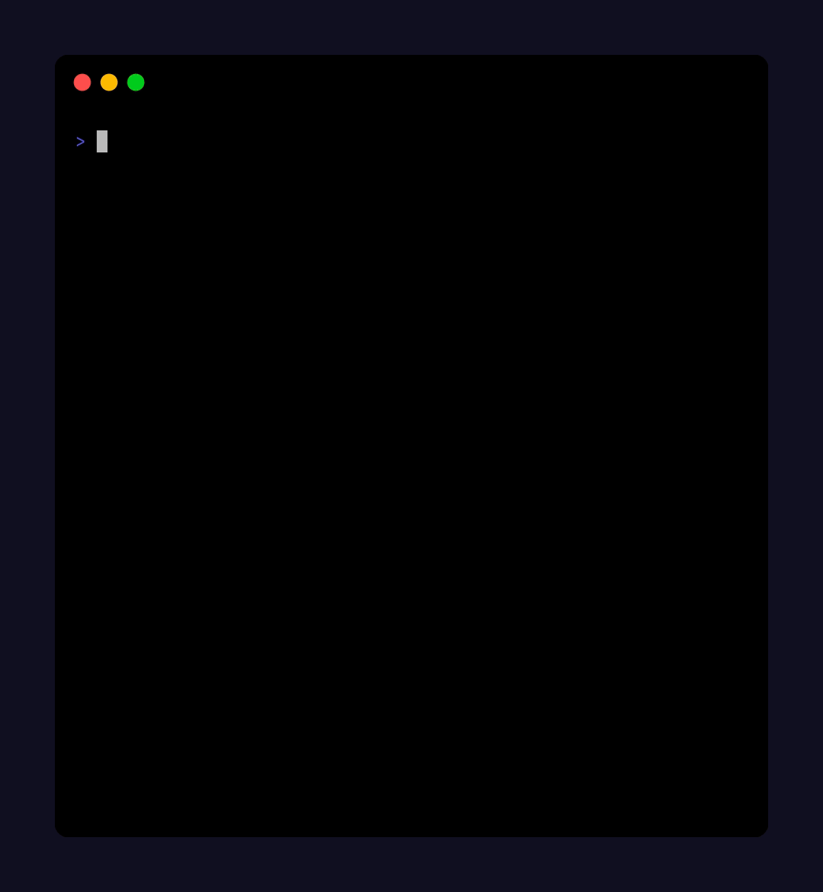

<div align="center">
    <h1>nyaa-cli</h1>
    
    <h4>Smart anime torrent fetcher with stateful episode tracking</h4>
</div>

<p align="center">
  <a href="#installation">Installation</a> |
  <a href="#usage">Usage</a> |
  <a href="#usage-patterns">Patterns</a> |
  <a href="#example-workflow">Workflow</a>
</p>

---

## Requirements

- `Bash 5.0+`
- `jq`
- `curl`
- `Go` _(needed for first-time installation of `pup`)_

<details>
<summary><strong>Bash 5+ (macOS users only)</strong></summary>

This script requires <strong>Bash 5.0 or later</strong>.

On macOS, the default <code>/bin/bash</code> is too old.
Install the latest Bash with Homebrew:

```sh
brew install bash
```

Then, either:

- Run the script with the full path:

  ```sh
  /opt/homebrew/bin/bash ./nyaa-cli ...
  ```

- Or, add Homebrew Bash to your PATH (Apple Silicon):

  ```sh
  echo 'export PATH="/opt/homebrew/bin:$PATH"' >> ~/.zshrc
  source ~/.zshrc
  ```

  (For Intel Macs, use <code>/usr/local/bin</code>)

Check your Bash version:

```sh
bash --version
```

It should say `5.x` or later

</details>

---

## Installation

```sh
# clone the repository
git clone https://github.com/metaory/nyaa-cli.git
cd nyaa-cli

# make the script executable
chmod +x nyaa-cli

# symlink the script to somewhere in $PATH
sudo ln -sf "$(pwd)/nyaa-cli" /usr/local/bin/nyaa-cli
```

## Usage

```dart
nyaa-cli :: Smart anime torrent fetcher with stateful episode tracking

Usage:
  nyaa-cli                                      # Smart mode: update all anime
  nyaa-cli -q 480                               # Smart mode with quality override
  nyaa-cli -n "one piece" -e 120                # Normal mode: specific episode
  nyaa-cli -n "one piece" -f 120 [-t 130]       # Normal mode: episode range

Options:
  -n, --name      Anime name (omit for smart mode)
  -e, --episode   Download a single episode
  -f, --from      Starting episode (exclusive with -e)
  -t, --to        Ending episode (optional, with -f)
  -q, --quality   Video quality (default: 720)
  -u, --uploader  Uploader filter (e.g. Erai, SubsPlease)
  -o, --output    Output directory (default: ./output)
  -h, --help      Show this help message

Smart Mode:
  • Omit --name to process all anime from state file
  • Uses stored preferences per anime (quality, uploader, output)
  • CLI options override stored preferences for this run
  • nyaa-cli --quality 1080 updates all anime with 1080p override

Notes:
  • -f and -e cannot be used together
  • -f without -t downloads all episodes from start
  • Not specifying -u picks highest seeder
```

### Examples

```bash
# Smart mode - update all anime from state file
nyaa-cli

# Smart mode with quality override
nyaa-cli --quality "1080"

# Smart mode with uploader preference
nyaa-cli --uploader "Erai"

# Basic usage - continues from last downloaded episode
nyaa-cli --name "one piece"

# Download a specific episode
nyaa-cli --name "one piece" --episode 120

# Download all episodes from a starting point
nyaa-cli --name "one piece" --from 120

# Download a specific range of episodes
nyaa-cli --name "one piece" --from 120 --to 130

# Additional options
nyaa-cli --name "one piece" --from 120 --quality "720"
nyaa-cli --name "one piece" --from 120 --uploader "Erai"
```

---

<div align="center">
   
   <p>Continue downloading from last tracked episode</p>
</div>

---

<details id="usage-patterns">
<summary><strong>Usage Patterns</strong></summary>

The script supports five main usage patterns:

1. **Smart Mode** (no `--name` provided)
   - Updates all anime from the state file automatically
   - Uses stored preferences (quality, uploader) per anime
   - CLI options override stored preferences for this run
   - Example: `nyaa-cli` or `nyaa-cli --quality 1080`

2. **Continue from Last Episode** (`--name` only)
   - Automatically continues from the last downloaded episode
   - If no previous episodes found, starts from episode 1
   - Uses state file to track progress

3. **Single Episode** (`--episode`)
   - Downloads a specific episode
   - Cannot be used with `--from` or `--to`
   - Example: `--episode 120`

4. **From Episode to Present** (`--from` without `--to`)
   - Downloads all available episodes from the starting point
   - Continues until no more episodes are found
   - Example: `--from 120`

5. **Episode Range** (`--from` and `--to`)
   - Downloads episodes within a specific range
   - `--to` must be greater than `--from`
   - Example: `--from 120 --to 130`
   </details>

---

<details>
<summary><strong>State Management</strong></summary>

The script maintains a state file at `~/.local/state/nyaa-cli/progress` to track the last downloaded episode for each anime. The state file is a TSV (Tab-Separated Values) file where:

- First column: Normalized anime name
- Second column: Last downloaded episode number

Example state file:

```
one+piece 1278
solo+leveling 18
witch+watch 21 quality:480
```

The state is automatically updated whenever an episode is downloaded, and is used to:

- Continue from the last downloaded episode when no episode is specified
- Track progress across multiple runs
- Start from episode 1 for new anime

</details>

---

<details>
<summary><strong>More Demos</strong></summary>
<div align="center">
   <div>
      <h3>Single Episode</h3>
      
      <p>Download a specific episode by number</p>
   </div>
   <hr>
   <div>
      <h3>Episode Range</h3>
      
      <p>Download multiple episodes within a range</p>
   </div>
   <hr>
   <div>
      <h3>From Episode</h3>
      
      <p>Download all episodes from a starting point</p>
   </div>
  <div>
    <h3>Smart Mode</h3>
    
    <p>Download all anime episodes with stored preferences</p>
  </div>
</div>
</details>

---

<details id="example-workflow">
<summary><strong>Example Workflow</strong></summary>

You can use `nyaa-cli` to automate your anime downloads with a torrent client that supports directory watching. For example, with **rtorrent**, you can configure it to watch a directory for new `.torrent` files. When a torrent file is placed there, rtorrent will automatically start downloading it.

A typical workflow:

1. Configure your torrent client (e.g., rtorrent) to watch a directory (e.g., `~/watch/torrents`).

2. Create a script to download new episodes (e.g., `~/bin/update-anime.sh`):

   ```sh
   #!/bin/bash

   # Update One Piece
   nyaa-cli --name "one piece" --output ~/watch/torrents

   # Update Solo Leveling
   nyaa-cli --name "solo leveling" --output ~/watch/torrents
   ```

3. Make the script executable:

   ```sh
   chmod +x ~/bin/update-anime.sh
   ```

4. Add a weekly cronjob to run the script (e.g., every Sunday at 2 AM):

   ```sh
   # Edit crontab
   crontab -e

   # Add this line
   0 2 * * 0 ~/bin/update-anime.sh
   ```

The script will:

- Use the state file to automatically continue from the last downloaded episode
- Download new episodes if available
- Save torrent files with normalized filenames (lowercase, no spaces, no special characters)
- Your torrent client will pick up the new files and start downloading automatically

Many other torrent clients also support directory watching for automation.

</details>

---

## Experimental Interactive Mode (Beta)

All arguments can now be collected through a guided prompt interface!

> [!CAUTION]
> **Try the new interactive mode** in the [`v2-interactive` branch](https://github.com/metaory/nyaa-cli/tree/v2-interactive)
>
> - 🚧 Not fully tested
> - 🚧 might contain unexpected behavior

---

## License

[MIT](LICENSE)
